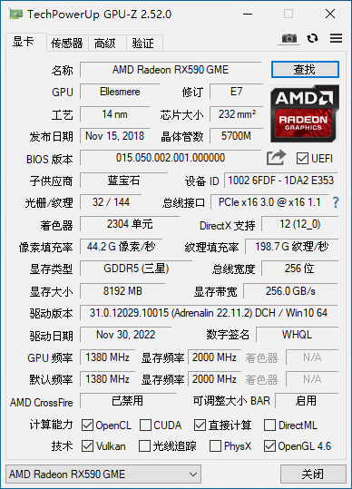

# RX 590 GME 刷 VBIOS

------

  最近显卡便宜，入手了蓝宝石的`RX 590 GME`白金版由于之前没做好功课，不知道`RX 590 GME`不是`RX 590`，不被MacOS支持，只能刷vbios。网上虽然有不少通过修改device-id的方式驱动`RX 590 GME`的，但我没成功，只能刷vbios，将`RX 590 GME`刷成`RX 580 `。

  顺便说一下，`RX 590 GME`本来就是`RX 580`满血版（2304SP）的马甲，可以直接刷成580，市面上很多`RX 580`的2048SP版本，其实是`RX 470`的马甲，也不被MacOS支持，要刷成`RX 470`的VBIOS。不过，买RX 590 GME也有个好处，就是这个卡2020年发布，只经历过一次矿难，比580这三朝元老好一些。

  刷VBIOS的过程比较简单，跟着网上的教程做就是，不过要提醒一下，刷VBIOS可能会失败，如果刷的VBIOS与显卡不兼容，就需要使用核显进到系统里，重新刷VBIOS。**如果你没有核显，那不要意思，不能亮机了。**

蓝宝石的`RX 590 GME`白金版，一直没找到合适的vbios，参考了这位大神提供的vbios：[蓝宝石 590 GME D5 8G可以刷的vbios，LinsensCN的博客](https://blog.csdn.net/Zhaodong_it/article/details/130265498?spm=1001.2014.3001.5502) 这位大神提供了两个vbios，反正我刷[1号vbios](./580/vbios/1.rom)一切正常，刷[2号vbios](./580/vbios/2.rom)时，黑屏。

我用的 amdvbflash 3.31 工具。刷VBIOS前，一定记得备份原VBIOS，防止刷不成功。

刷之前的GPU-Z截图：



由于刷VBIOS会将设备ID从6FDF刷成67DF，图形界面不让刷，只能从命令行强刷，刷VBIOS命令行如下：

```cmd
Microsoft Windows [版本 10.0.19045.2006]
(c) Microsoft Corporation。保留所有权利。

X:\Users\Administrator\Desktop\amdvbflash_win_3.31>amdvbflash.exe -i
AMDVBFLASH version 3.31 EXTERNAL, Copyright (c) 2021 Advanced Micro Devices, Inc.


adapter bn dn fn dID       asic           flash      romsize test    bios p/n
======= == == == ==== =============== ============== ======= ==== ==============
   0    01 00 00 6FDF Polaris20       GD25Q21B         40000 pass 113-4E353GU-S80

X:\Users\Administrator\Desktop\amdvbflash_win_3.31>amdvbflash.exe -unlockrom 0
AMDVBFLASH version 3.31 EXTERNAL, Copyright (c) 2021 Advanced Micro Devices, Inc.

ROM Unlocked

X:\Users\Administrator\Desktop\amdvbflash_win_3.31>amdvbflash.exe -fp -fa -p 0 1.rom
AMDVBFLASH version 3.31 EXTERNAL, Copyright (c) 2021 Advanced Micro Devices, Inc.

Old SSID: E353
New SSID: E353
Old P/N: 113-4E353GU-S80
New P/N: 113-4E353BU-O6Q
Old DeviceID: 6FDF
New DeviceID: 67DF
Old Product Name: E353 Polaris20 XTX A1 GDDR5 8GB 300e/400m
New Product Name: E353 Polaris20 XTX A1 GDDR5 8GB 300e/400m
Old BIOS Version: 015.050.002.001.000000
New BIOS Version: 015.050.002.001.000000
Flash type: GD25Q21B
40000/40000h bytes programmed
40000/40000h bytes verified

Restart System To Complete VBIOS Update.
```


刷完之后的GPU-Z截图：


有人担心从590刷成580性能会下降，这里可以对比一下刷之前和刷之后的跑分，可以发现，刷之前的默认频率是1380，刷之后的默认频率是1366，有些许降低，跑分也会有略微降低，但是总体影响不大（请忽略截图里的硬盘跑分）。
另外，刷之前甜甜圈烤鸡78°，刷之后烤鸡76°。


